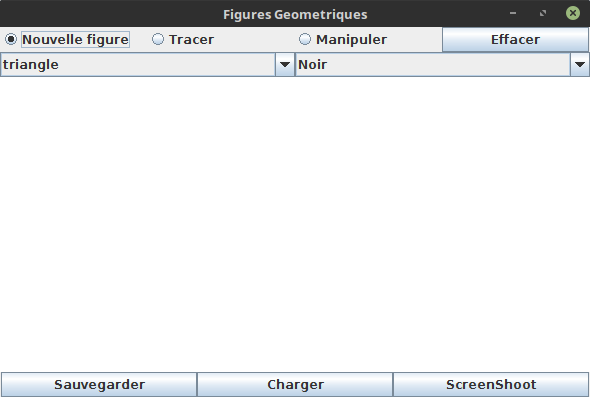
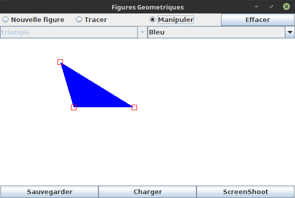
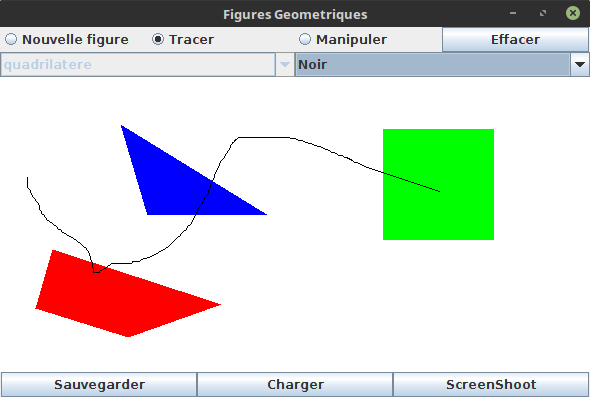
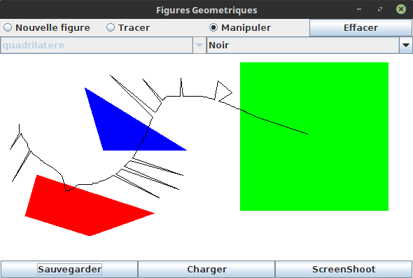

# Figures_Geometrique

## Sujet

Le projet consiste à réaliser un logiciel de dessin.
Il doit être possible de dessiner avec la souris.
De choisir une couleur pour les formes à dessiner.
En plus de cer cles, il doit être possible de réaliser les polygones suivant :
* triangle
* carré
* rectangle
* quadrilatere 
La possibilité d'effacer l'écran, de sauvegarder ou charger des dessins précédemment réalisé,
ou encore de prendre des captures d'écran doivent être implémentée.
Nous devions aussi implémenter le faite de pouvoir manipuler les formes présente sur l'écran.

Vidéo de démonstration dans /videos.

[Présentation](Anthony.pdf)

### Compilation

javac *.java
java Fenetre

### Fonctionnement

Dans le menu du haut, il est possible de choisir entre :

* Nouvelle figure : Permet de choisir entre les différentes formes à dessiner.
Il suffit ensuite de cliquer sur l'écran pour placer les sommets des formes (
triangles: 3; carré: 2; rectangle: 3; quadrilatere: 4; cercle: 2).

* Tracer : Dessiner à l'écran en cliquant 

* Manipuler : Cliquer sur un sommet de figure pour le déplacer. Cliquer sur le point d'un tracé permet de le déplacer.

Au milieu de la fenêtre, se trouve l'écran.
Dans le bas, il est possible de sauvegarder les figures tracées, avec charger de charger la précédente sauvegarde, et avec screenshot de prendre une capture d'écran. 